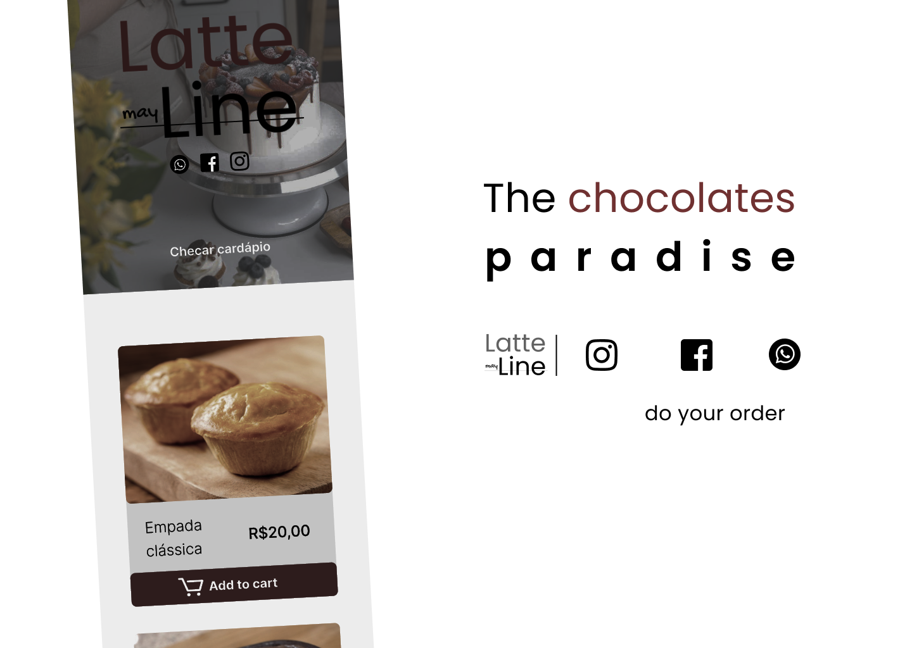

<h2 align="center">🍫 Welcome to the Chocolates Paradise</h2>
<h3 align="center" >
  <a href="#the-problem">The Problem</a>  •   <a href="#features">Features</a>
</h4> 
 
<h4 align="center">
 ✔️ Project status: Done, but always open to new ideas!🎇
</h4> 
<h4 align="center">
  ❗Check the deploy prototype on: <a href="https://suyannesara.github.io/LatteLine/">https://suyannesara.github.io/LatteLine/</a>
</h4>
<h4 align="center">
  <a href="https://www.figma.com/file/Hvg9tB5xqBGg0CRq0V5NTT/Untitled?node-id=13%3A46">Check the interface design on Figma</a>
</h4> 
    

<h2 align="center" id="the-problem">CAP1 - The Problem</h2>

> <h4>"lOADING..."</h4> 
 

<h2 align="center" id="features">CAP2 - Functionalities</h2>

- [x] Order registration
- [x] Order sending using the whatsapp api system

 
<h2 align="center">👩🏻Thanks for reading, hope you like it!</h2>  

